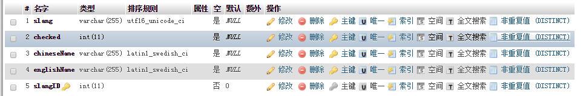
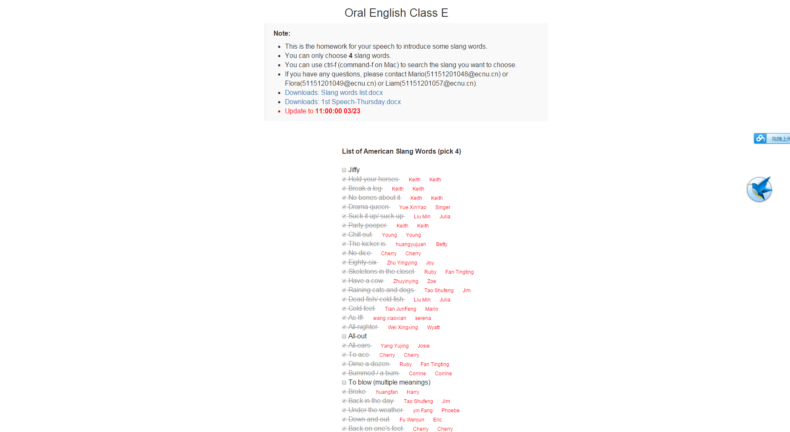

# English-Slang
This is developed for our english course to help us choose four and  only four words, respectively. 

**Story**: Erin tell us to choose 4 slang words from a slang list, and no one chooses the same slang. One solution is replying the email to all. However, I, liam and flora think it will in choses to reveive such many emails. And we spent a whole afternoon to design a website. Thanks for the brilliat of liam, he is really good at design (Lol), we solve all problems in 2 days and happily send a email to Erin, but she didn't reply me, which makes me sad. And the emails of list comed while I had not been ready for it. Someone used email, someone choose across our website. Crazy things happened, I tried to solve the confict by contacting one by one. And more crazily, some emails can not receive by my school mail.  And It costed me a few days to solve the conflict and apologize for the mistake of the email !!!!


## Pre-Requirements
- PHP
- MySQL

## Create Tabel In Mysql

### Solution.1 
```sql
CREATE TABLE IF NOT EXISTS `Slang` (
  `slang` varchar(255) CHARACTER SET utf16 COLLATE utf16_unicode_ci DEFAULT NULL,
  `checked` int(11) DEFAULT NULL,
  `chineseName` varchar(255) DEFAULT NULL,
  `englishName` varchar(255) DEFAULT NULL,
  `slangID` int(11) NOT NULL DEFAULT '0'
) ENGINE=InnoDB DEFAULT CHARSET=latin1;
```


### Solution.2
  执行[SQL](res/Slang.sql)

## Import data
  
### CSV 
  [CSV Download](res/Slang.csv)

### SQL
  [SQL Download](res/Slang.sql)


##Put In Your Server! Enjoy Your Self!



